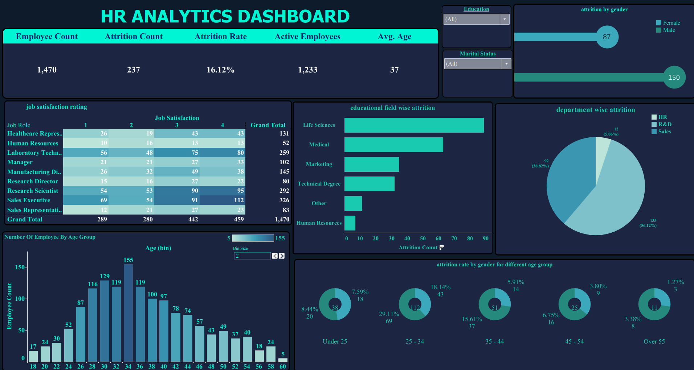

# HR Analytics Dashboard (Tableau Project)

## 📌 Project Overview
This repository contains a comprehensive HR Analytics Dashboard built using **Tableau**. The project delivers a full workforce diagnostic of an enterprise dataset containing **1,470 employees**, tracking key metrics like headcount, retention trends, and corporate satisfaction to pinpoint macro drivers behind the company's **16.12% global attrition rate**.

The goal of this project is to assist HR leadership and executive stakeholders in transitioning from reactive talent management to proactive, data-driven workforce planning.

---

## 📊 Key Executive Insights
By cross-tabulating demographics, departments, and sentiment data, the dashboard uncovered several high-risk talent pockets:

*   **Generational Attrition Focus:** Over half of all organizational turnover is front-loaded. **47.3% of all departures** (112 exits) are concentrated heavily within the 25–34 age cohort, strongly led by male professionals (29.11% attrition rate).
*   **Departmental & Academic Gaps:** The Sales department represents the largest risk zone, driving **56.12% of total company attrition**. Furthermore, over **64% of total turnover** originated from specialized Life Sciences and Medical degree graduates, indicating a crucial gap in specialized onboarding or early-career pathing.
*   **Job Satisfaction Hotspots:** A 9-role Job Satisfaction Heatmap Matrix isolated high-volume, low-satisfaction vulnerabilities. Critical retention risks were flagged among **Sales Executives, Laboratory Technicians, and Research Scientists**.
*   **Advanced Dynamic Segmentation:** The dashboard utilizes parameter filters to allow stakeholders to run deep diagnostic cohort queries (e.g., isolating specific demographics like the *Divorced* marital status cohort) to extract hidden risk factors.

---
## Dashboard-

## 🛠️ Dashboard Architecture & Design Choices
The layout was designed following professional data visualization and UI/UX best practices:
*   **High-Impact KPI Blocks:** Instantly exposes baseline metrics (Total Headcount: 1,470, Attrition Count: 237, Active Capacity: 1,233, Average Age: 37) at a glance.
*   **Ranked Descending Sequences:** Educational field turnover is sorted from highest frequency to lowest, removing cognitive load for immediate rank recognition.
*   **Conic Doughnut Models:** Highlights relative departmental slices while embedding the absolute historical exit count in the core center.
*   **Chronological Gauge Rings:** Arranges age groups sequentially (Under 25 ➔ Over 55) to map the continuous lifecycle progression of employee turnover.

---

## 🚀 How to View the Project
1. Clone this repository.
2. Open the `.twbx` workbook file using **Tableau Desktop** or **Tableau Public**.
3. (Optional) Review the included presentation slides or PDF documentation for the full executive briefing and 4-quarter strategic retention roadmap.
